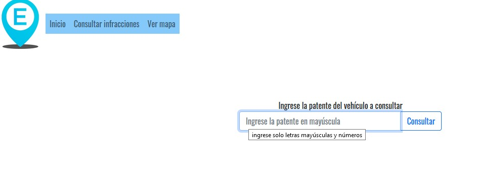

= Sistema de Estacionamiento Medido

Prototipo de un sistema de estacionamiento medido realizado para un trabajo práctico de la materia ingeniería de software.

La funcionalidades implementadas abarcan como mínimo los casos de uso relacionados
con la comunicación con los sistemas externos de información geográfica y de consulta de
infracciones a traves de consultas a una API.
Se hace las referencias geográficas para ver el estado del estacionamiento
en un mapa, facilitar la búsqueda de lugares libres, los puntos de venta y mostrar la
ubicación particular para algún estacionamiento activo.
Sobre las infracciones, se muestra como un conductor puede solicitar un listado
con todas sus infracciones vigentes, y mostrar la información del lugar del depósito para una
infracción que incluya el acarreo.

.Consulta de infracciones

.Login

.Mapa de zonas de estacionamiento

